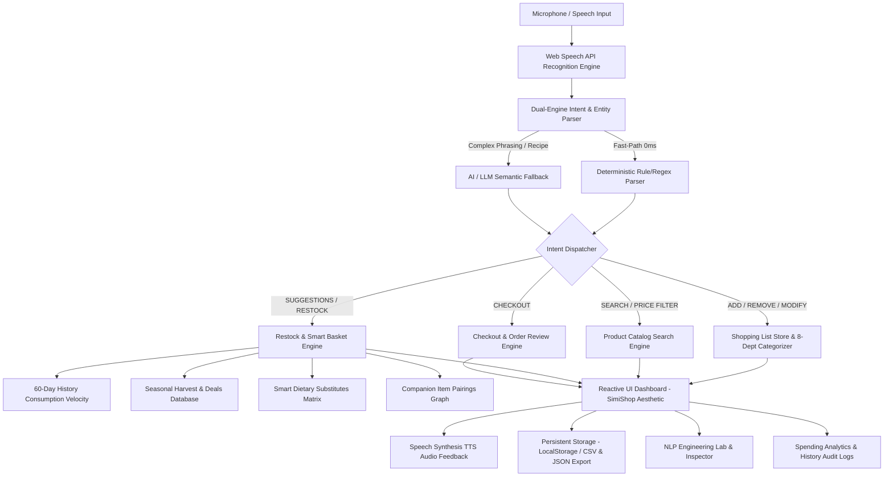

# VoiceCart AI — Intelligent Voice-Enabled Grocery Assistant

[](https://github.com/MAYANK479/voice_cart_ai/actions/workflows/ci.yml)
[](https://voicecommandai.netlify.app)
[](https://react.dev/)
[](https://www.typescriptlang.org/)
[](https://vitejs.dev/)
[](https://vitest.dev/)
[](https://opensource.org/licenses/MIT)

**[🌐 Live Demo (voicecommandai.netlify.app)](https://voicecommandai.netlify.app)** • **[System Architecture](#system-architecture)** • **[Testing Suite](#testing--quality-assurance)** • **[Voice Command Reference](#supported-voice-commands)** • **[Known Limitations](#known-limitations)**

---

## Executive Approach Write-Up (174 Words)

> **VoiceCart AI** is a client-side grocery shopping assistant built with **React 18, TypeScript, and Vite**. The platform pairs the browser's native **Web Speech API** with a high-throughput, deterministic rule-based intent and entity parser that extracts compound quantities (*"half a dozen"*), units, brands, dietary tags (*"organic"*), price bounds (*"under $5"*), and target lists with sub-millisecond execution. An optional AI/LLM semantic fallback handles complex conversational recipe requests.
>
> For grocery intelligence, VoiceCart AI provides:
> 1. **Predictive Restock & Smart Basket**: Calculates consumption velocity from purchase history to forecast depletion dates and assemble a personalized smart basket in one click.
> 2. **Deterministic Auto-Categorization**: Organizes items into 8 supermarket aisles using longest-match token heuristics.
> 3. **Smart Substitutes & Pairings**: Offers dietary, allergen, and budget alternatives alongside meal pairings.
> 4. **End-to-End Grocery Checkout**: Full order review with delivery time slots, coupon verification, live tracking simulation, and printable receipts.
>
> The application runs entirely client-side without proprietary backend overhead, features zero-latency feedback, includes 57 automated tests, and adheres to a clean Apple × Linear consumer aesthetic.

---

## System Architecture

VoiceCart AI is structured with a strict separation of concerns across speech ingestion, intent resolution, domain intelligence, and reactive state management:



### Architectural Tradeoff: Deterministic Parser vs External LLM
- **Fast-Path Deterministic Parser**: Operates with **0ms network latency**, **$0 compute cost**, and deterministic repeatability for common grocery operations (*"Add 2 gallons of milk and 6 eggs"*).
- **LLM Semantic Fallback**: Available in the NLP Lab and when confidence is low, enabling extraction from free-form conversational queries (*"I want to bake a strawberry cake"*).

---

## Supported Voice Commands

The parser supports continuous voice input across **5 languages** (English, Spanish, French, German, Hindi):

| Intent Category | Example Voice Command | Parser Output & Execution |
| :--- | :--- | :--- |
| **Add Single Item** | `"Add 2 bottles of organic milk"` | Adds item to Dairy with price, unit, and dietary tag |
| **Multi-Item Chaining** | `"Add 2 boxes of cereal and 1 loaf of bread"` | Concurrently adds items across distinct departments |
| **Word Numbers & Fractions**| `"I need half a dozen pasture raised eggs"` | Normalizes quantity = 6, unit = carton, dept = Dairy |
| **Price-Bounded Search** | `"Find Colgate toothpaste under $5"` | Opens catalog filtered by brand + maximum price |
| **Price Range Filter** | `"Find snacks between $2 and $6"` | Filters products within price window |
| **Predictive Restock** | `"What should I restock?"` | Opens velocity-calculated restock prediction modal |
| **Smart Substitutes** | `"Suggest a substitute for butter"` | Opens dietary/allergen alternative recommendation modal |
| **Seasonal & Deals** | `"What is in season today?"` | Displays peak-harvest seasonal produce and promotional discounts |
| **Modify Quantity** | `"Change apples quantity to 5"` | Updates quantity with voice feedback |
| **Remove / Delete** | `"Remove milk from my list"` | Deletes item with 1-click Undo toast protection |
| **Multi-List Routing** | `"Add coffee to office list"` | Directs item to the target list (`office`, `party`, etc.) |
| **Checkout & Order** | `"Proceed to checkout"` / `"Order now"` | Routes to the order verification and delivery checkout page |
| **Multilingual (Spanish)** | `"Añadir 2 botellas de leche orgánica"` | Native Spanish token and unit normalization |
| **Multilingual (Hindi)** | `"दो पैकेट दूध जोड़ें"` | Native Hindi token and entity parsing |

---

## Core Feature Pillars

### 1. Smart Restock & Smart Basket ("Build My List")
- **Consumption Velocity Algorithm**: Compares elapsed days against mean purchase cycle to prioritize items approaching depletion (e.g. Milk consumed every 7 days $\rightarrow$ highlighted at Day 6).
- **1-Click Smart Basket**: Assembles habit-driven staples into a personalized basket with batch addition.

### 2. Supermarket 8-Department Categorization
- Organizes items into: **Produce, Dairy & Eggs, Bakery, Meat & Seafood, Pantry, Beverages, Snacks, and Household**.
- Uses longest-match compound phrase resolution (e.g., *"Orange Juice"* $\rightarrow$ Beverages, *"Fresh Orange"* $\rightarrow$ Produce).

### 3. Dedicated NLP Engineering Inspector (NLP Lab)
- Interactive engineering playground allowing developers to test phrasing, inspect extracted entity tokens, compare rule-based vs LLM parsing latency, and copy the raw JSON Abstract Syntax Tree (AST).

### 4. Modern Grocery Checkout & Order Fulfillment
- Order review with item selection checklists, quantity adjustments, delivery slot options (Standard, Express 1-Hour, Store Pickup), coupon code validator (`VOICECART10`, `FREESHIP`), simulated live order tracking, and printable receipts.

### 5. Spending Analytics & Budget Management
- Live budget tracking widget with progress visuals, over-budget indicators, spending distribution charts, and undo-protected deletions.

---

## Testing & Quality Assurance

VoiceCart AI includes an automated unit test suite executed with **Vitest**:

```bash
# Run the complete test suite
npm test
```

### Verified Test Summary (57 / 57 Passing across 7 Test Suites):
- `src/tests/nlpParser.test.ts` (15 tests)
  - Multi-item sentence chaining (*"Add 2 boxes of cereal and 1 gallon of milk"*)
  - Word numbers and fractional quantities (*"half a dozen"*, *"dozen"*)
  - Price bounds (*"under $5"*, *"between $2 and $6"*)
  - Brand and size parsing (*"Colgate"*, *"large"*)
  - Multilingual command extraction (Spanish, Hindi)
  - Deterministic confidence scoring
- `src/tests/checkout.test.ts` (14 tests)
  - Order subtotal calculations for selected/unselected items
  - Promo code discounts (`VOICECART10`, `HARVEST15`, `FREESHIP`)
  - Free delivery threshold verification (>$35) and express tier
  - Estimated tax (8%) and grand total computations
  - Item quantity increment/decrement bounds and receipt ID generation
- `src/tests/multiListAndSmartBasket.test.ts` (7 tests)
  - Target list extraction (*"to party list"*, *"to office list"*)
  - Checkout voice intent routing
  - Smart basket generation from historical purchase frequency
- `src/tests/storageAndHistory.test.ts` (6 tests)
  - LocalStorage persistence and migration defaults
  - Undo deletion recovery
- `src/tests/categorizer.test.ts` (6 tests)
  - Department categorization (8 supermarket aisles)
  - Price estimation bounds and category emoji mapping
- `src/tests/llmFallback.test.ts` (5 tests)
  - AI semantic fallback and multi-ingredient recipe bundle generation
  - Natural phrasing removal, search, and budget resolution
- `src/tests/recommendationEngine.test.ts` (4 tests)
  - Depletion date prediction from consumption velocity
  - Active list deduplication and dietary substitute matching


---

## Known Limitations

1. **Speech Recognition Browser Support**: Voice recognition utilizes the standard W3C Web Speech API (`webkitSpeechRecognition`), supported natively in Google Chrome, Microsoft Edge, Brave, Android Chrome, and Safari (desktop & iOS with microphone permissions). Firefox currently lacks full Web Speech recognition support.
2. **Internet Connection for Speech Recognition**: While the UI and parsing engine run entirely client-side, the browser's speech-to-text service streams audio to transcription services in Chromium browsers.
3. **Curated Seed Catalog**: The 50+ item product catalog and pricing are curated benchmark data modeled after standard supermarket inventory distributions.

---

## Data Sources & Modeling

The product catalog (`src/data/catalogData.ts`), historical consumption frequency (`src/data/historyData.ts`), and nutritional pairings (`src/data/pairingsData.ts`) are structured based on USDA food categories and retail grocery pricing averages.

---

## Quickstart & Local Setup

```bash
# 1. Clone repository
git clone https://github.com/MAYANK479/voice_cart_ai.git
cd voice_cart_ai

# 2. Install dependencies
npm install

# 3. Start local development server
npm run dev
```

Open **`http://localhost:5173/`** in Google Chrome or Microsoft Edge.

---

## Production Build

```bash
# Build optimized production bundle
npm run build
```

Bundle is generated in `dist/` with zero build warnings and is ready for static deployment on Netlify, Vercel, or GitHub Pages.

---

## License

MIT License. Designed and developed by **Mayank Pandey**.
