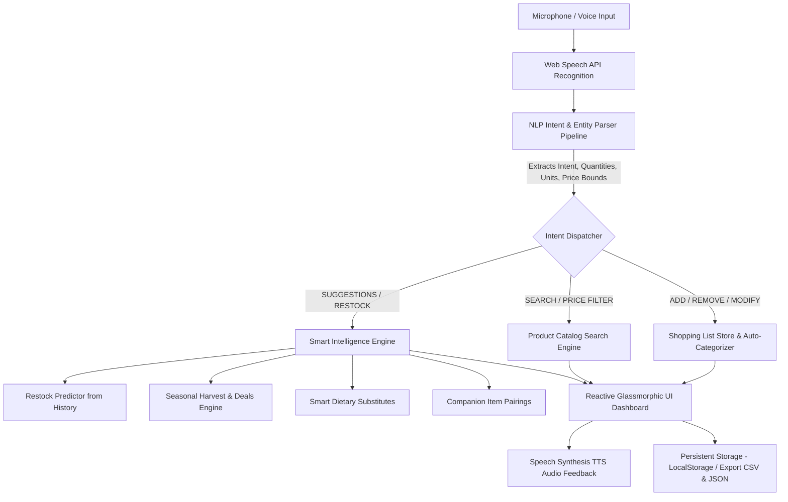

# 🛒 VoiceCart AI — Voice Command Shopping Assistant

> **Technical Assessment Submission**  
> **Role:** Software Engineer Position  
> **Project:** Voice Command Shopping Assistant with Smart AI Suggestions

---

## 🌟 Executive Summary / Approach Write-Up (Max 200 Words)

**VoiceCart AI** is an intelligent, voice-first shopping list manager and recommendation engine built with **React 18, TypeScript, and Vite**. The system integrates the native **Web Speech API** (`webkitSpeechRecognition` & `SpeechSynthesis`) with a custom deterministic Natural Language Processing (NLP) pipeline that extracts user intents, fractional/word quantities (*"half a dozen"*), grocery units (*"cartons"*, *"liters"*), product attributes (*"organic"*, *"gluten-free"*), and price bounds (*"under $5"*), while supporting multi-item chaining (*"Add 2 apples and 1 carton of milk"*).

For intelligence, the platform features a multi-tiered suggestion engine:
1. **Predictive Restock Engine**: Analyzes shopping history and consumption cycles (velocity) to alert users when staples run low.
2. **Dynamic Seasonal & Deals Engine**: Recommends peak-harvest produce and discounted items.
3. **Smart Substitutes & Companion Engine**: Identifies dietary, allergy, and budget alternatives alongside meal pairings (e.g., chips $\rightarrow$ salsa).

Built with modular separation of concerns, the app auto-categorizes items into 8 departments, offers multilingual support (English, Spanish, French, German, Hindi), tracks budgets with live progress visuals, provides accessible TTS voice confirmations, and runs 100% offline with zero external paid dependencies.

---

## 🏗️ System Architecture



---

## ✨ Key Features & Capabilities

### 1. Voice Input & NLP
- **Voice Command Recognition**: Full hands-free voice control with continuous recognition and live soundwave visualizer.
- **Flexible Natural Language Processing**: Understands diverse phrases:
  - *"Add milk"* vs *"I need 2 bottles of organic milk"* vs *"Buy 5 oranges"*.
  - **Multi-Item Chaining**: *"Add 2 boxes of cereal and 1 gallon of milk"*.
- **Multilingual Support**: Switch seamlessly between **English (US/UK/IN), Spanish (Español), French (Français), German (Deutsch), and Hindi (हिन्दी)**.
- **Two-Way Voice Feedback (TTS)**: Spoken voice confirmations for all actions with instant mute/unmute control.

### 2. Smart AI Suggestions & Intelligence
- **Product Restock Predictions**: Calculates consumption frequency from shopping history (e.g., milk lasts 4 days $\rightarrow$ predicts running low on Day 6).
- **Seasonal & On-Sale Recommendations**: Curated seasonal catalog highlighting peak harvest nutrients and discounts.
- **Dietary & Healthier Substitutes**: Intelligent substitute finder (e.g., Whole Milk $\rightarrow$ Almond/Oat Milk; Sugar $\rightarrow$ Stevia/Honey; White Bread $\rightarrow$ Gluten-Free Multigrain).
- **Companion Item Pairings**: Dynamic cross-selling alerts (e.g., adding *Tortilla Chips* prompts a companion pairing with *Salsa*).

### 3. Shopping List Management & Organization
- **Auto-Categorization**: Categorizes groceries into 8 departments (**Produce, Dairy & Eggs, Bakery, Meat & Seafood, Pantry, Beverages, Snacks, Household & Care**).
- **Quantity & Unit Management**: Interactive steppers, unit normalization, and line totals.
- **Budget Tracking**: Live estimated cost calculation, remaining budget indicator, over-budget alerts, and custom budget limits.
- **List Operations**: Check off items (with celebratory confetti animation), clear completed, clear all, and export to **CSV & JSON**.

### 4. Voice-Activated Search & Price Filtering
- Search across a rich 38+ item catalog with dietary tags (*Organic, Gluten-Free, Vegan, Keto, Sugar-Free*).
- Voice price boundary filters: *"Find toothpaste under $5"*, *"Search snacks below 4 dollars"*, *"Show items between $2 and $6"*.

---

## 🚀 Getting Started Locally

### Prerequisites
- Node.js (v18 or higher)
- npm (v9 or higher)

### Installation & Run

```bash
# 1. Install project dependencies
npm install

# 2. Run the development server
npm run dev
```

The application will be accessible at: **`http://localhost:5173/`**

---

## 🧪 Automated Testing

The project includes unit tests for the NLP parser and recommendation algorithms using **Vitest**:

```bash
# Run the test suite
npm run test
```

### Verified Test Scenarios:
- ✅ Simple and complex multi-item phrase parsing
- ✅ Entity extraction (quantities, units, attributes, price bounds)
- ✅ Auto-categorization department accuracy
- ✅ Restock prediction calculations against historical cycles
- ✅ Dietary substitute matching and companion item discovery

---

## 📁 Codebase Directory Structure

```text
voice_command/
├── index.html                   # Entry HTML with fonts and SEO meta
├── package.json                 # Dependencies & scripts
├── tsconfig.json                # Strict TypeScript configuration
├── vite.config.ts               # Vite bundler configuration
├── src/
│   ├── main.tsx                 # React application entry point
│   ├── App.tsx                  # Root component layout
│   ├── index.css                # Glassmorphic dark design system & animations
│   ├── types/
│   │   ├── shopping.ts          # Shopping item, category, suggestion types
│   │   ├── speech.ts            # NLP intent and speech recognition types
│   │   └── catalog.ts           # Product catalog and filter types
│   ├── services/
│   │   ├── categorizer.ts       # Auto-categorization engine
│   │   ├── nlpParser.ts         # Natural language intent & entity parser
│   │   ├── recommendationEngine.ts # Restock, seasonal, substitute algorithms
│   │   ├── speechService.ts     # Web Speech API wrapper
│   │   ├── ttsService.ts        # Text-to-speech audio feedback
│   │   └── storageService.ts    # Persistence & CSV/JSON export
│   ├── data/
│   │   ├── categories.ts        # 8 Grocery department definitions
│   │   ├── catalogData.ts       # Mock catalog (38+ items with prices & tags)
│   │   ├── substituteData.ts    # Substitute mappings
│   │   ├── seasonalData.ts      # Seasonal product recommendations
│   │   ├── pairingsData.ts      # Companion pairing dataset
│   │   ├── historyData.ts       # Pre-seeded purchase frequency records
│   │   └── languageData.ts      # Multilingual configuration & voice prompts
│   ├── context/
│   │   └── ShoppingContext.tsx  # Centralized global state management
│   ├── components/
│   │   ├── Header.tsx           # Navbar, language switcher, audio controls
│   │   ├── VoiceAssistant/      # Voice orb, live transcript, quick prompt pills
│   │   ├── ShoppingList/        # Auto-categorized list, items cards, export
│   │   ├── Sidebar/             # Budget widget, Restock alerts
│   │   ├── Modals/              # Catalog search, Smart AI suggestions, Help guide
│   │   └── UI/                  # Toasts & feedback
│   └── tests/
│       ├── nlpParser.test.ts    # NLP & categorization unit tests
│       └── recommendationEngine.test.ts # Restock & substitute unit tests
```

---

## 🌐 Production Deployment Guide

To deploy this application to any static hosting provider (Vercel, Netlify, Firebase Hosting, Cloudflare Pages, AWS S3):

```bash
# Build the optimized production bundle
npm run build
```
The output will be generated in the `dist/` directory, ready to deploy.

---

## 📄 License
MIT License. Built for Technical Assessment Evaluation.
