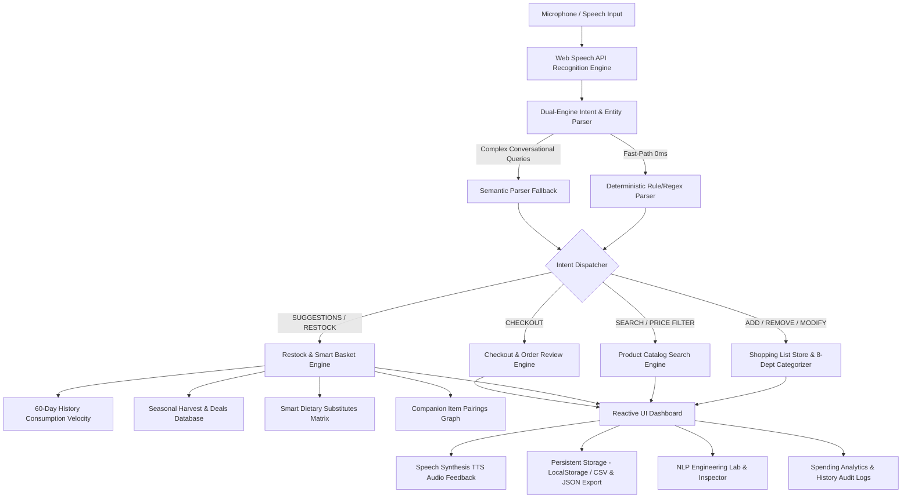

# FreshFlow — Voice-Enabled Grocery Shopping Assistant

[](https://github.com/MAYANK479/voice_cart_ai/actions/workflows/ci.yml)
[](https://voice-cart-ai-opal.vercel.app/)
[](https://react.dev/)
[](https://www.typescriptlang.org/)
[](https://vitejs.dev/)
[](https://vitest.dev/)
[](https://opensource.org/licenses/MIT)

**[Live Demo](https://voice-cart-ai-opal.vercel.app/)** • **[Architecture](#system-architecture)** • **[Voice Command Reference](#supported-voice-commands)** • **[Error Handling & Accessibility](#error-handling--accessibility)** • **[Testing](#testing--quality-assurance)** • **[Local Setup](#quickstart--local-setup)**

---

## Overview

**FreshFlow** is a client-side grocery shopping web application built with **React 18, TypeScript, and Vite**. The system integrates the browser's native **Web Speech API** with a deterministic natural language parser that tokenizes speech transcripts into structured shopping actions (item names, compound quantities, units, brands, dietary tags, price bounds, and target lists) with sub-millisecond execution.


### Key Capabilities
1. **Predictive Restock & Smart Basket**: Calculates consumption velocity from purchase history to forecast depletion dates and pre-populate recurring staples.
2. **Deterministic Department Categorization**: Automatically routes items into 8 supermarket aisles using longest-match phrase resolution.
3. **Smart Substitutes & Meal Pairings**: Provides dietary, allergen, and budget alternatives alongside meal companion suggestions.
4. **End-to-End Grocery Checkout**: Order review with delivery time slots, coupon verification, order tracking simulation, and printable receipts.
5. **Interactive NLP Engineering Inspector**: A developer playground to inspect AST token outputs and compare deterministic regex execution against optional semantic parsing.

---

## System Architecture



### Architectural Decisions & Tradeoffs
- **Deterministic Rule Engine (Primary)**: Handles 95%+ of structured shopping commands (*"Add 2 boxes of cereal and 1 gallon of milk"*) in **<1ms with 0 network overhead** and deterministic test coverage.
- **Semantic Fallback (Secondary)**: Used for unstructured, multi-ingredient recipe requests (*"I want to bake a strawberry cake"*).
- **Client-Side State & Storage**: State is managed via React Context and persisted in LocalStorage with optimistic updates and undo recovery.

---

## Supported Voice Commands

The parser supports continuous voice input across **5 languages** (English, Spanish, French, German, Hindi):

| Intent Category | Example Voice Command | Parser Output & Execution |
| :--- | :--- | :--- |
| **Add Single Item** | `"Add 2 bottles of organic milk"` | Adds item to Dairy with price, unit, and dietary tag |
| **Multi-Item Chaining** | `"Add 2 boxes of cereal and 1 loaf of bread"` | Concurrently adds items across distinct departments |
| **Word Numbers & Fractions**| `"I need half a dozen pasture raised eggs"` | Normalizes quantity = 6, unit = carton, dept = Dairy |
| **Price-Bounded Search** | `"Find Colgate toothpaste under $5"` | Opens catalog filtered by brand + maximum price |
| **Price Range Filter** | `"Find snacks between $2 and $6"` | Filters products within price window |
| **Predictive Restock** | `"What should I restock?"` | Opens velocity-calculated restock prediction modal |
| **Smart Substitutes** | `"Suggest a substitute for butter"` | Opens dietary/allergen alternative recommendation modal |
| **Seasonal & Deals** | `"What is in season today?"` | Displays peak-harvest seasonal produce and promotional discounts |
| **Modify Quantity** | `"Change apples quantity to 5"` | Updates quantity with audio and visual feedback |
| **Remove / Delete** | `"Remove milk from my list"` | Deletes item with 1-click Undo toast protection |
| **Multi-List Routing** | `"Add coffee to office list"` | Directs item to the target list (`office`, `party`, etc.) |
| **Checkout & Order** | `"Proceed to checkout"` / `"Order now"` | Routes to the order verification and delivery checkout page |
| **Multilingual (Spanish)** | `"Añadir 2 botellas de leche orgánica"` | Native Spanish token and unit normalization |
| **Multilingual (Hindi)** | `"दो पैकेट दूध जोड़ें"` | Native Hindi token and entity parsing |

---

## Error Handling & Accessibility

### Speech Recognition Resilience
- **Permission Denied (`not-allowed`)**: Detects blocked microphone permissions and displays clear browser-level unblock instructions alongside the keyboard fallback input.
- **No Speech Detected (`no-speech`)**: Gracefully resets speech status to idle after timeout without triggering error banners.
- **Network Interruption (`network`)**: Catches speech synthesis and recognition drops, preserving local list state and notifying the user.
- **Audio Feedback Controls**: Speech synthesis volume and feedback can be toggled on/off at any time via the header mute control.

### Accessibility (a11y) & Keyboard Navigation
- **Keyboard Fallback Bar**: Users without microphone access can type natural language commands directly with full keyboard focus management (`Enter` to submit, `Esc` to dismiss modals).
- **ARIA Live Regions**: Screen readers receive dynamic transcript updates via `aria-live="polite"` regions.
- **High-Contrast Theme Palette**: Full light (`Softly Day`) and dark (`Softly Dusk`) themes adhering to WCAG AA color contrast ratios.
- **Optimistic State with Undo Protection**: Destructive actions (deleting an item, clearing lists) display an immediate undo toast to prevent accidental data loss.

---

## Testing & Quality Assurance

VoiceCart AI includes an automated test suite executed with **Vitest**:

```bash
npm test
```

### Verified Test Suite (57 Passing Tests across 7 Modules):
- **`nlpParser.test.ts`** (15 tests) — Multi-item chaining, word numbers, fractions, price bounds, brand/size tags, and multilingual token parsing.
- **`checkout.test.ts`** (14 tests) — Subtotal math, promo code verification (`VOICECART10`, `HARVEST15`), shipping tier thresholds, and tax.
- **`multiListAndSmartBasket.test.ts`** (7 tests) — Multiple list routing and consumption velocity smart basket generation.
- **`storageAndHistory.test.ts`** (6 tests) — LocalStorage persistence and undo recovery.
- **`categorizer.test.ts`** (6 tests) — Supermarket aisle classification (8 departments), category emoji mapping, and price estimation.
- **`llmFallback.test.ts`** (5 tests) — Semantic fallback and recipe ingredient bundle extraction.
- **`recommendationEngine.test.ts`** (4 tests) — Depletion velocity forecasting and dietary substitute matching.

---

## Quickstart & Local Setup

```bash
# 1. Clone repository
git clone https://github.com/MAYANK479/voice_cart_ai.git
cd voice_cart_ai

# 2. Install dependencies
npm install

# 3. Start local development server
npm run dev
```

Open **`http://localhost:5173/`** in Google Chrome or Microsoft Edge.

---

## Production Build

```bash
# Build optimized production bundle
npm run build
```

Bundle is output to `dist/` with 0 warnings/errors.

---

## License

MIT License. Developed by **Mayank Pandey**.

